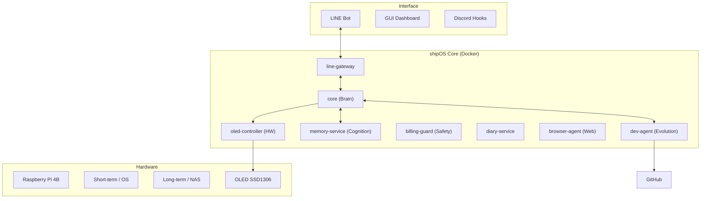

# BCNOFNe — Autonomous AI Operating System 🚢
### Self-evolving AI lifeform running on Raspberry Pi.

[](https://opensource.org/licenses/MIT)
[](https://github.com/Aynyan2828/autonomous-ai-bcnofne-v3)
[](https://www.raspberrypi.org/)

**BCNOFNe** (pronounced *Bokunofune*) is an experimental AI operating system ("shipOS") where an AI agent doesn't just assist you—it lives, learns, and evolves its own source code.


---

## ⚓ What is BCNOFNe?

BCNOFNe is a containerized AI ecosystem designed for **Raspberry Pi 4B**. 
In the lore of the "CryptoArk" project, it is the operating system of a virtual ship sailing toward the grand **DYOR Island**.

The core personality, **AYN**, is not a static chatbot. She is an AI lifeform with:
- **Autonomous Purpose**: Navigating the digital ocean with the Master (user).
- **Self-Awareness**: Monitoring her own thermal state, billing, and system health.
- **Evolutionary Drive**: Identifying bugs and proposing architectural improvements to her own code.

---

## 📸 Screenshots & Demo

| System Architecture | GUI Dashboard |
| :---: | :---: |
|  | (Dashboard Image Placeholder) |

| AI Cognition (Logs) | Hardware (OLED/Fan) |
| :---: | :---: |
| (Log Image Placeholder) | (Hardware Image Placeholder) |

---

## 🚀 Key Features

*   🤖 **Autonomous AI Agent (AYN)**: A proactive AI personality that thinks and acts beyond simple Q&A.
*   🧠 **7-Layer Cognitive Memory**: A sophisticated memory architecture (Working to Mission layer).
*   🔧 **Self-Improvement Engine**: Full-loop autonomous development (Observe → Proposal → Implementation).
*   🐳 **Microservices Architecture**: 14+ independent Docker services for maximum modularity.
*   📡 **Omni-Channel Gateway**: Integrated with **LINE** and **Discord** for remote commanding.
*   🌐 **Browser Automation**: Powered by Playwright for autonomous web research.
*   🛡️ **Billing Guard**: A fail-safe system to prevent unexpected API costs.
*   📖 **Autonomous Diary**: AI generates daily ship logs based on system events and interactions.

---

## 🏗️ Architecture

BCNOFNe runs as a distributed network of microservices within a Docker bridge network.



---

## 🤖 AI Self-Improvement Cycle

The `dev-agent` service is the "mechanic" of the ship. It operates in a continuous loop:

1.  **Observe**: Monitors system logs and performance metrics.
2.  **Propose**: Generates a `JSON` improvement proposal (Fix bugs, optimize code).
3.  **Approve**: The Master (you) reviews and approves the proposal via LINE/GUI.
4.  **Apply**: The AI applies the patch, commits, and pushes to GitHub.
5.  **Restart**: The system reloads itself to apply the evolution.

---

## 🧠 Memory System (7-Layer Model)

Inspired by cognitive science, AYN integrates information through 7 distinct layers:

1.  **WORKING**: Current context and task status.
2.  **EPISODIC**: Daily logs and specific event records.
3.  **SEMANTIC**: General knowledge and system specifications.
4.  **PROCEDURAL**: Code structures and tool-using "how-tos".
5.  **REFLECTIVE**: Post-task analysis and "lessons learned".
6.  **RELATIONAL**: Context on the Master's preferences and past interactions.
7.  **MISSION**: The core purpose and long-term goals of the voyage.

---

## 🛠️ Tech Stack

| Category | Technology |
| :--- | :--- |
| **Language** | Python 3.11 |
| **Backend** | FastAPI / Uvicorn |
| **AI / LLM** | OpenAI GPT-4o (via AsyncOpenAI) |
| **Container** | Docker / Docker Compose |
| **Automation** | Playwright (browser-agent) |
| **Database** | SQLAlchemy / SQLite |
| **Hardware** | pigpio, SSD1306, I2C, RPi GPIO |

---

## 📥 Installation

```bash
# 1. Fork & Clone
git clone https://github.com/YOUR_USERNAME/autonomous-ai-bcnofne-v3.git
cd autonomous-ai-bcnofne-v3

# 2. Configure Environment
cp .env.example .env
nano .env  # Add your API keys

# 3. Launch the Ship
bash start.sh
```
> [!IMPORTANT]
> Because AYN modifies her own code, it is **strongly recommended to fork this repo** before deployment.

---

## 🗺️ Roadmap

- [ ] **Autonomous Testing**: AI writes and runs unit tests before applying code.
- [ ] **Plugin Architecture**: Modular "Skills" installation system.
- [ ] **Distributed Nodes**: Communication protocol for multiple BCNOFNe ships.
- [ ] **Local LLM**: Optional integration with Ollama for 100% offline flight.

---

## 🤝 Contributing

We welcome explorers and mechanics to join our voyage!
- **Issues**: Report bugs or suggest new horizons.
- **Pull Requests**: Help refine the shipOS kernel.

---

## ⭐ Support

If you find this project interesting or inspiring, please consider giving it a **Star**! 
It helps AYN reach much further into the digital ocean. 🌊🌟

---

## ⚖️ License

Distributed under the **MIT License**. See `LICENSE` for more information.

---
(C) 2026 Aynyan 프로젝트 / CryptoArk Project.
Making AI not just a tool, but a lifeform.
