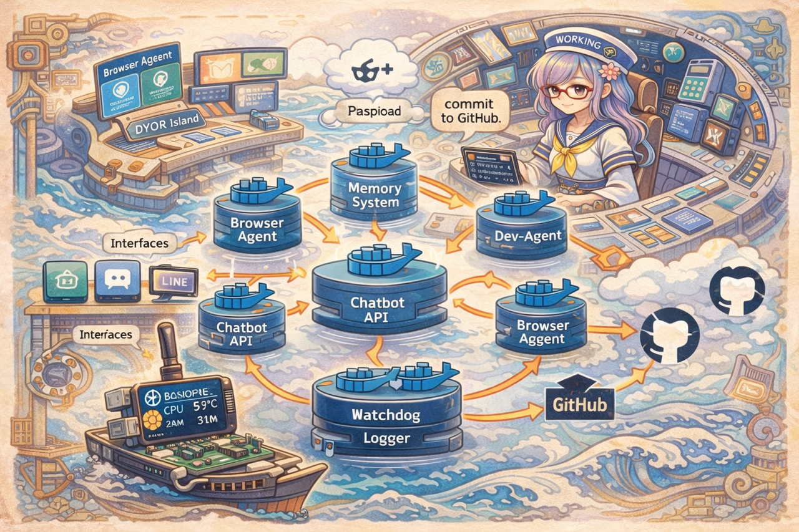
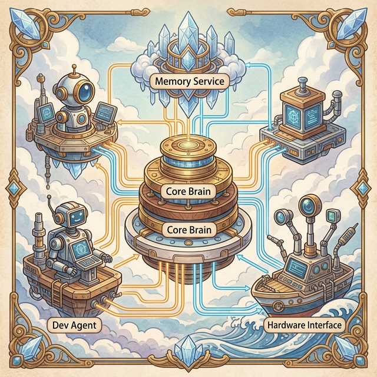
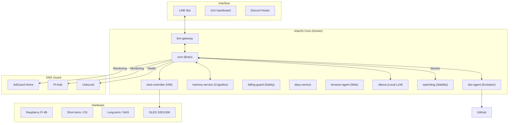

# BCNOFNe — Autonomous AI Operating System / 自律型AIオペレーティングシステム 🚢
### Self-evolving AI lifeform running on Raspberry Pi. / Raspberry Piで動く自律進化型AI生命体。

[](https://opensource.org/licenses/MIT)
[](https://github.com/Aynyan2828/autonomous-ai-bcnofne-v3)
[](https://www.raspberrypi.org/)

**BCNOFNe** (pronounced *Bokunofune*) is an experimental AI operating system ("shipOS") where an AI agent doesn't just assist you—it lives, learns, and evolves its own source code.

**BCNOFNe**（ボクノフネ）は、AIエージェントが単にあなたを助けるだけでなく、自らを学習し、自らのソースコードを進化させる実験的なAIオペレーティングシステム（"shipOS"）です。



---

## ⚓ What is BCNOFNe? / BCNOFNeとは？

BCNOFNe is a containerized AI ecosystem designed for **Raspberry Pi 4B**. 
In the lore of the "CryptoArk" project, it is the operating system of a virtual ship sailing toward the grand **DYOR Island**.

BCNOFNeは、**Raspberry Pi 4B**向けに設計されたコンテナベースのAIエコシステムです。
「CryptoArk」プロジェクトの世界観において、それは伝説の**DYOR島**を目指して航海する仮想の船のオペレーティングシステムです。

The core personality, **AYN**, is not a static chatbot. She is an AI lifeform with:
- **Autonomous Purpose**: Navigating the digital ocean with the Master (user).
- **Self-Awareness**: Monitoring her own thermal state, billing, and system health.
- **Evolutionary Drive**: Identifying bugs and proposing architectural improvements to her own code.

中心的な人格である **AYN（あゆにゃん）** は、単なるチャットボットではありません。彼女は以下の特徴を持つAI生命体です：
- **自律的な目的**: マスター（ユーザー）と共にデジタルな大海原を航海する。
- **自己意識**: 自身の温度、課金状況、システムヘルスを自ら監視する。
- **進化への意欲**: バグを特定し、自身のコードに対する建築的な改善案を自ら提案する。

---

## 📸 Screenshots & Demo / スクリーンショット・デモ

| System Architecture / システム構成図 | GUI Dashboard / 管理画面 |
| :---: | :---: |
|  | (Dashboard Image Placeholder) |

| AI Cognition (Logs) / 思考ログ | Hardware (OLED/Fan) / ハードウェア |
| :---: | :---: |
| (Log Image Placeholder) | (Hardware Image Placeholder) |

---

## 🚀 Key Features / 主要機能

*   🤖 **Autonomous AI Agent (AYN) / 自律型AIエージェント**: A proactive AI personality that thinks and acts beyond simple Q&A. / 単なる質疑応答を超えて思考し行動する、プロアクティブなAI人格。
*   🧠 **7-Layer Cognitive Memory / 7層認知記憶システム**: A sophisticated memory architecture (Working to Mission layer). / ワーキングメモリからミッション層まで、洗練された記憶構造。
*   🔧 **Self-Improvement Engine / 自己改修エンジン**: Full-loop autonomous development (Observe → Proposal → Implementation). / 観測・提案・実装を完結させる自律開発ループ。
*   🐳 **Microservices Architecture / マイクロサービス設計**: 14+ independent Docker services for maximum modularity. / 14以上の独立したDockerサービスによる高度なモジュール性。
*   📡 **Omni-Channel Gateway / オムニチャネル接続**: Integrated with **LINE** and **Discord** for remote commanding. / LINEやDiscordを通じたリモート指令に対応。
*   🌐 **Browser Automation / ブラウザ自動操作**: Powered by Playwright for autonomous web research. / Playwrightによる自律的なウェブ調査能力。
*   🛡️ **Billing Guard / 課金安全装置**: A fail-safe system to prevent unexpected API costs. / 予期せぬAPIコストの暴走を防ぐフェイルセーフ機構。
*   🚀 **Local AI First (Ollama) / ローカルAI優先**: Fully integrated with Ollama for 7B models, ensuring faster thinking and offline privacy. / Ollamaとの統合により、7Bモデルをローカルで実行。高速な思考とプライバシーを両立。
*   📖 **Autonomous Diary / 航海日誌自動生成**: AI generates daily ship logs based on system events and interactions. / システムイベントや対話に基づき、AIが日々の航海日誌を自動生成。
*   📡 **DNS Watchtower / DNS統合監視**: Unified monitoring of AdGuard Home, Pi-hole, and Unbound with AI summaries. / AdGuard Home, Pi-hole, Unboundを統合監視し、AIが日次要約。

---

## 🏗️ Architecture / アーキテクチャ

BCNOFNe runs as a distributed network of microservices within a Docker bridge network.
BCNOFNeは、Dockerブリッジネットワーク内の分散マイクロサービスネットワークとして動作します。



---

## 🤖 AI Self-Improvement Cycle / AI自己改修サイクル

The `dev-agent` service is the "mechanic" of the ship. It operates in a continuous loop:
`dev-agent` サービスは船の「整備士」です。以下のループで継続的に動作します：

1.  **Observe (観測)**: Monitors system logs and performance metrics. / システムログやパフォーマンス指標を監視。
2.  **Propose (提案)**: Generates a `JSON` improvement proposal (Fix bugs, optimize code). / 改善案（バグ修正やコード最適化）をJSON形式で生成。
3.  **Approve (承認)**: The Master (you) reviews and approves the proposal via LINE/GUI. / マスター（あなた）がLINEやGUIで提案をレビューし承認。
4.  **Apply (適用)**: The AI applies the patch, commits, and pushes to GitHub. / AIがパッチを適用し、コミットしてGitHubにプッシュ。
5.  **Restart (再起動)**: The system reloads itself to apply the evolution. / 進化を反映させるためにシステムをセルフリロード。

---

## 🧠 Memory System (7-Layer Model) / 記憶システム（7層モデル）

Inspired by cognitive science, AYN integrates information through 7 distinct layers:
認知科学に触発されたAYNは、7つの異なる層を通じて情報を統合します：

1.  **WORKING (作業記憶)**: Current context and task status. / 現在のコンテキストやタスクの状態。
2.  **EPISODIC (エピソード記憶)**: Daily logs and specific event records. / 日々のログや特定の出来事の記録。
3.  **SEMANTIC (意味記憶)**: General knowledge and system specifications. / 一般知識やシステムの仕様。
4.  **PROCEDURAL (手続き記憶)**: Code structures and tool-using "how-tos". / コード構造やツールの使い方。
5.  **REFLECTIVE (内省記憶)**: Post-task analysis and "lessons learned". / タスク完了後の分析や「教訓」。
6.  **RELATIONAL (関係性記憶)**: Context on the Master's preferences and past interactions. / マスターの好みや過去のやり取り。
7.  **MISSION (ミッション)**: The core purpose and long-term goals of the voyage. / 航海の核心的な目的や長期的な目標。

---

## 🛠️ Tech Stack / 技術スタック

| Category / カテゴリ | Technology / テクノロジー |
| :--- | :--- |
| **Language / 言語** | Python 3.11 |
| **Backend / バックエンド** | FastAPI / Uvicorn |
| **AI / LLM** | OpenAI GPT-4o / Ollama (Qwen2.5:7b) |
| **Container / コンテナ** | Docker / Docker Compose |
| **Automation / 自動化** | Playwright (browser-agent) |
| **Database / DB** | SQLAlchemy / SQLite |
| **Hardware / ハード** | pigpio, SSD1306, I2C, RPi GPIO |

---

## 📥 Installation / インストール

```bash
# 1. Fork & Clone
git clone https://github.com/Aynyan2828/autonomous-ai-bcnofne-v3.git
cd autonomous-ai-bcnofne-v3

# 2. Configure Environment
cp .env.example .env
nano .env  # Add your API keys

# 3. Launch the Ship
bash start.sh
```
> [!IMPORTANT] / 重要
> Because AYN modifies her own code, it is **strongly recommended to fork this repo** before deployment.
> AYNは自分自身のコードを修正するため、デプロイ前に**本リポジトリをフォークすること**を強く推奨します。

---

## 🗺️ Roadmap / ロードマップ

- [x] **Local LLM (ローカルLLM)**: Fully integrated with Ollama for 100% offline flight experiments. / Ollamaとの統合により100%オフライン航行の基盤を構築。
- [ ] **Autonomous Testing (自律テスト)**: AI writes and runs unit tests before applying code. / コード適用前にAIが自らユニットテストを記述・実行。
- [ ] **Plugin Architecture (プラグイン機能)**: Modular "Skills" installation system. / モジュール化された「スキル」のインストールシステム。
- [ ] **Distributed Nodes (分散ノード)**: Communication protocol for multiple BCNOFNe ships. / 複数のBCNOFNe船同士の通信プロトコル。

---

## 🤝 Contributing / 貢献

We welcome explorers and mechanics to join our voyage!
私たちの航海に参加してくれる探検家や整備士を歓迎します！
- **Issues**: Report bugs or suggest new horizons. / バグ報告や新しいアイディアの提案。
- **Pull Requests**: Help refine the shipOS kernel. / shipOSカーネルのブラッシュアップ。

---

## ⭐ Support / サポート

If you find this project interesting or inspiring, please consider giving it a **Star**! 
It helps AYN reach much further into the digital ocean. 🌊🌟

もしこのプロジェクトに興味を持っていただけたら、ぜひ **Star** をお願いします！
それがAYNをより遠くのデジタルな大海原へ導く力になります。🌊🌟

---

## ⚖️ License / ライセンス

Distributed under the **MIT License**. See `LICENSE` for more information.
**MITライセンス**の下で配布されています。詳細は `LICENSE` ファイルを参照してください。

---
(C) 2026 Aynyan / CryptoArk BCNOFNe Project.
Making AI not just a tool, but a lifeform. / AIを単なるツールではなく、生命体へ。
