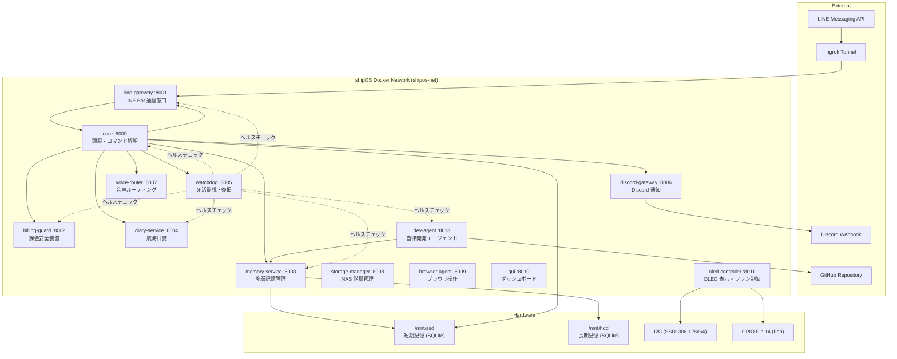

# autonomous AI BCNOFNe system v3 — 完全仕様書
## (CryptoArk Edition / shipOS)

> **最終更新**: 2026-03-09 | **稼働バージョン**: v3.1.5-fix
> **ハードウェア**: Raspberry Pi 4B (Raspberry Pi OS Bookworm 64bit)

---

## 1. システム概要

**autonomous AI BCNOFNe system** は、Raspberry Pi 4B 上で稼働する **自律型AIオペレーティングシステム「shipOS」** です。
AI人格「**AYN（あゆにゃん）**」が、元素記号をモチーフとした仮想の船『BCNOFNe（ボクノフネ）』のOSとして機能し、マスター（ユーザー）と共に壮大な世界観『**DYOR島**』目指し航海するという設定のもと、日常生活を自律的にサポートします。

### 設計思想
- **マイクロサービスアーキテクチャ**: 全機能を独立したDockerコンテナに分離し、障害の局所化と個別更新を実現
- **自律進化**: AIが自らコードの改善提案を生成し、マスターの承認を経て自動適用する
- **自己修復 (Self-Healing)**: データベーススキーマの不整合を起動時に自動検知・修復する機構を搭載
- **安全第一**: 課金上限監視による暴走防止機構を最重要サービスとして配置

---

## 2. アーキテクチャ



---

## 3. 全14サービス詳細

### 3.1 core (ポート 8000) — 頭脳
| 項目 | 内容 |
|------|------|
| **役割** | AIの思考・コマンド解釈・全体指示を行うメインモジュール |
| **AI モデル** | OpenAI GPT (AsyncOpenAI クライアント経由) |
| **主要機能** | LINE メッセージ受信→解釈→応答、自律思考ループ（10分間隔）、システム状態管理、提案ワークフロー管理 |
| **キャラクター** | 博多弁を話す「AYN」。一人称は「うち」。船の比喩表現を使用 |

**対応 LINE コマンド例:**
- `/health` — CPU温度・メモリ使用率・ストレージ状態の報告
- `/status` — 現在のシステムモード表示
- `/diary` — 今日の航海日誌を取得
- `/report` — 今日のシステムログをAIが要約して報告
- `/proposals` — 保留中の自律改善提案一覧
- `/approve <ID>` — 提案を承認し自動適用を指示
- `/reject <ID>` — 提案を却下
- `/sync` — GitHub から最新コードを同期
- `/restart` — 全コンテナ再起動
- `start.sh` — RasPi 上で start.sh を実行

**自律思考ループ:**
10分ごとにシステム状態・ログ・メモリを分析し、必要に応じてマスターへ能動的に発言・提案を行う。

---

### 3.2 line-gateway (ポート 8001) — LINE Bot 通信窓口
| 項目 | 内容 |
|------|------|
| **役割** | LINE Messaging API との Webhook 受信・返信・プッシュ通知 |
| **ライブラリ** | `line-bot-sdk` (LineBotApi, WebhookHandler) |
| **エンドポイント** | `/webhook` (受信), `/api/v1/reply` (返信), `/api/v1/push` (能動通知) |

---

### 3.3 billing-guard (ポート 8002) — 課金安全装置 ⚠️最重要
| 項目 | 内容 |
|------|------|
| **役割** | OpenAI API 等の課金状況を監視し、設定上限を超えたらAIの動作を強制停止 |
| **設計意図** | 自律AIの暴走によるAPI課金爆発を防ぐための **最重要安全装置** |

---

### 3.4 memory-service (ポート 8003) — 多層記憶管理
| 項目 | 内容 |
|------|------|
| **役割** | 人間の脳を模した7層メモリシステムの CRUD と要約を提供 |
| **データベース** | SSD (短期記憶: `shipos.db`) + HDD (長期記憶: `shipos_longterm.db`) の2層構造 |
| **自動アーカイブ** | 重要度4以上、または REFLECTIVE / SEMANTIC 層のメモリは自動的に HDD にも保存 |

**7層メモリモデル:**

| 層名 | 用途 |
|------|------|
| `WORKING` | 作業用一時メモリ（短命） |
| `EPISODIC` | 出来事・履歴 |
| `SEMANTIC` | 知識・仕様・恒常的情報 |
| `PROCEDURAL` | 手順・スキル・ノウハウ |
| `REFLECTIVE` | 反省・学習・改善 |
| `RELATIONAL` | マスターとの関係性・好み |
| `MISSION` | 中長期目標・保留タスク |

**提案管理 (AutoImprovementProposal):**
dev-agent が生成した改善提案（整備計画書）の永続化と状態管理も担当。
ステータス: `PENDING` → `APPROVED` → `APPLIED` or `FAILED` / `REJECTED` / `EXPIRED`

---

### 3.5 diary-service (ポート 8004) — 航海日誌
| 項目 | 内容 |
|------|------|
| **役割** | 日々の航海記録（ログ）をまとめ、日誌エントリとして保存 |
| **データモデル** | `DiaryEntry` (date_str, summary, created_at) |

---

### 3.6 watchdog (ポート 8005) — 死活監視・復旧
| 項目 | 内容 |
|------|------|
| **役割** | 他の全コンテナへの定期ヘルスチェック（60秒間隔）と異常検知 |
| **監視対象** | core, line-gateway, billing-guard, memory-service, diary-service, dev-agent |
| **復旧機能** | Docker API (`docker.from_env()`) 経由で個別コンテナ再起動。自身(watchdog)は最後に再起動 |
| **特権** | `/var/run/docker.sock` をマウントしてDockerコンテナを直接制御 |

---

### 3.7 discord-gateway (ポート 8006) — Discord 通知
| 項目 | 内容 |
|------|------|
| **役割** | Discord Webhook への通知専用口 |
| **トリガー** | `ShipLogger` が WARN / ERROR / CRITICAL レベルのログを検知した際に自動通知 |

---

### 3.8 voice-router (ポート 8007) — 音声ルーティング
| 項目 | 内容 |
|------|------|
| **役割** | 読み上げや音声操作モードの切り替え |
| **対応モード** | NURSE (ナースロボタイプT) / OAI (OpenAI TTS) / HYB (ハイブリッド) |

---

### 3.9 storage-manager (ポート 8008) — NAS 階層管理
| 項目 | 内容 |
|------|------|
| **役割** | SSD/HDD 間の階層化ファイル移動などの安全なNAS管理 |
| **マウント** | `/mnt/ssd` (短期), `/mnt/hdd` (長期・ログ) |

---

### 3.10 browser-agent (ポート 8009) — ブラウザ操作
| 項目 | 内容 |
|------|------|
| **役割** | Playwright によるブラウザの自律操作実行環境 |

---

### 3.11 gui (ポート 8010) — ダッシュボード
| 項目 | 内容 |
|------|------|
| **役割** | ブラウザから見られるシステムステータスダッシュボード |

---

### 3.12 oled-controller (ポート 8011) — OLED 表示 + ファン制御 🖥️
| 項目 | 内容 |
|------|------|
| **役割** | SSD1306 (128x64 I2C) OLED ディスプレイへのリアルタイム表示 + GPIO ファン制御 |
| **ハードウェア** | I2C (/dev/i2c-1), GPIO (/dev/gpiomem), Fan (GPIO Pin 14) |
| **特権** | `privileged: true` でハードウェアアクセス |

**OLED 表示内容:**
- ロゴ付き起動アニメーション (プログレスバー付き)
- シャットダウンアニメーション（帰港演出）
- CPU温度、メモリ使用率
- 現在のモード表示 (SAIL/PORT/DOCK/ANCHOR/SOS)
- AIの感情フェイス表示 (`(-_-)`, `(o_o)`, `(x_x)`, `( ..)phi` 等)
- IP アドレス等のスクロール表示

**ファン制御:**
- 60°C以上: ファンON
- 45°C以下: ファンOFF

**ShipMode ↔ 航海モード対応表:**

| モード | 表示 | 意味 |
|--------|------|------|
| SAIL | `SAIL >===>` | 自律航行中 |
| PORT | `PORT >===>` | ユーザー優先 |
| DOCK | `DOCK >===>` | メンテナンス |
| ANCHOR | `ANCHOR>===>` | 省電力 |
| SOS | `SOS >===>` | セーフモード |

---

### 3.13 dev-agent (ポート 8013) — 自律開発エージェント 🤖
| 項目 | 内容 |
|------|------|
| **役割** | **自分自身のコードを改善する自律開発ループ** |
| **AI モデル** | OpenAI GPT (AsyncOpenAI) |
| **ループ間隔** | 1時間ごとにシステムを観測し改善案を練る |
| **ソースアクセス** | `/app/src` (リポジトリ全体をマウント) |
| **ワークスペース** | `/app/workspace` (安全な実験場) |

**自律開発フロー:**
1. **観測 (Observe)**: システム状態とメモリ要約を取得
2. **提案生成**: OpenAI に改善案を依頼
3. **実装 (Process)**: workspace 上で修正を実装・テスト（リトライ機能付き）
4. **提案保存**: `PROP-YYYYMMDD-XXXX` 形式のIDで memory-service に保存
5. **マスター承認待ち**: LINE でマスターに通知、`/approve` を待つ
6. **適用 (Apply)**: 承認後、workspace から本番ソースへ反映、git commit & push

**GitHub 同期機能:**
`/sync` コマンドで `git pull origin main` を実行し最新コードを取得。

---

### 3.14 ngrok — 外部トンネル
| 項目 | 内容 |
|------|------|
| **役割** | LINE Webhook を受信するための HTTPS トンネル |
| **イメージ** | `ngrok/ngrok:latest` |
| **接続先** | `line-gateway:8001` |

---

## 4. データベース設計

### ストレージ構成
| ストレージ | パス | DB ファイル | 用途 |
|-----------|------|------------|------|
| **SSD** (短期記憶) | `/mnt/ssd` | `shipos.db` | 高速アクセス用。作業記憶・システム状態 |
| **HDD** (長期記憶) | `/mnt/hdd` | `shipos_longterm.db` | 大容量保存用。重要記憶のアーカイブ |

### テーブル一覧

| テーブル名 | モデル | 主な用途 |
|-----------|--------|---------|
| `system_state` | `SystemState` | KVS形式のシステム状態保持 |
| `memories` | `Memory` | 7層メモリ管理 (topic, content, layer, importance) |
| `diary_entries` | `DiaryEntry` | 航海日誌 |
| `system_logs` | `SystemLog` | 各サービスのイベントログ |
| `improvement_proposals` | `AutoImprovementProposal` | 自律改善提案の管理 |

### 自己修復 (Self-Healing DB Migration)
起動時に `shared/__init__.py` の `migrate_db()` が各データベースを検査し、モデル定義に存在するがテーブルに欠落しているカラムを自動的に `ALTER TABLE` で追加する。
これにより、スキーマ変更に起因するクラッシュを自動回避する。

---

## 5. 統合ロギングシステム (ShipLogger)

全サービス共通の `ShipLogger` クラスが **3つの出力先** に同時にログを記録:

| 出力先 | 形式 | 用途 |
|--------|------|------|
| **SQLite** (`system_logs` テーブル) | レコード | core の自律思考ループでの分析用 |
| **JSON ファイル** (`/mnt/hdd/logs/system_log.json`) | JSONL | 永続的なログアーカイブ |
| **Discord** (discord-gateway 経由) | テキスト | WARN/ERROR/CRITICAL 時にリアルタイム通知 |

非同期ループが利用できない場合のフォールバック機構を搭載し、同期スレッドからの呼び出しでもクラッシュしない堅牢性を持つ。

---

## 6. 起動シーケンス (start.sh)

```
1. IP アドレス探索
   ├── Tailscale IP 取得 (tailscale ip -4)
   └── LAN IP 取得 (hostname -I からフィルタリング)
2. .env ファイルに IP を書き込み
3. Docker Compose  
   ├── docker compose down
   ├── docker compose pull
   └── docker compose up -d --build
4. ngrok 起動 (ホスト側で直接起動)
   ├── pkill ngrok (古いプロセス停止)
   ├── ngrok http 8001 (バックグラウンド起動)
   └── Webhook URL 取得 (localhost:4040/api/tunnels)
5. Webhook URL を .env と DB に保存
```

---

## 7. ネットワーク構成

| 接続方式 | 用途 |
|---------|------|
| **LAN** (192.168.0.x) | ローカルアクセス (GUI ダッシュボード等) |
| **Tailscale** (100.x.x.x) | リモートセキュアアクセス |
| **ngrok HTTPS トンネル** | LINE Webhook 受信 |
| **Docker bridge (shipos-net)** | サービス間内部通信 (サービス名で名前解決) |

---

## 8. 技術スタック

| カテゴリ | 技術 |
|---------|------|
| **言語** | Python 3.11 |
| **Web フレームワーク** | FastAPI + Uvicorn |
| **AI** | OpenAI GPT (AsyncOpenAI) |
| **コンテナ** | Docker + Docker Compose |
| **データベース** | SQLite (SQLAlchemy ORM) × 2 (SSD/HDD) |
| **メッセージング** | LINE Bot SDK, Discord Webhook |
| **OLED** | adafruit-circuitpython-ssd1306 (I2C) |
| **ファン制御** | digitalio (GPIO Pin 14) |
| **ブラウザ自動化** | Playwright |
| **トンネル** | ngrok |
| **VPN** | Tailscale |
| **バージョン管理** | Git + GitHub |
| **システム監視** | psutil, Docker SDK for Python |

---

## 9. 現在の稼働状況 (v3.1.5-fix)

✅ **全14サービス正常稼働中**

### 直近の修正内容 (v3.1.5-fix)
- **DB 自己修復機能**: `memories` テーブルに `layer` カラムが欠落していた場合、起動時に自動追加
- **ロガー堅牢化**: 非同期ループがないスレッドからのログ呼び出し時の `RuntimeError` を修正
- **IP 検知改善**: Docker コンテナ内でも環境変数フォールバックを使って正しい IP を表示
- **OLED レイアウト調整**: ステータス行とスクロール行の位置を入れ替え
