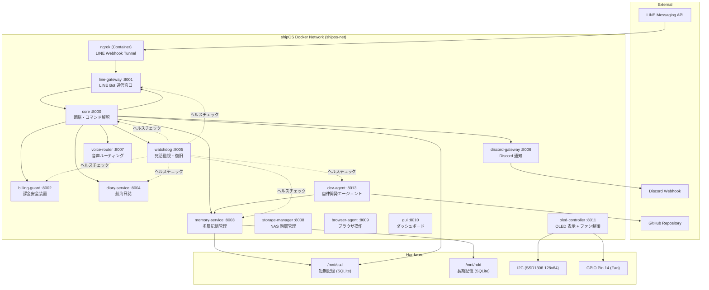

# autonomous AI BCNOFNe system v3 — 完全仕様書 / Complete Specification
## (CryptoArk Edition / shipOS)

> **最終更新 / Last Updated**: 2026-03-11 | **稼働バージョン / Current Version**: v3.3.0
> **ハードウェア / Hardware**: Raspberry Pi 4B (Raspberry Pi OS Bookworm 64bit)

---

## 1. システム概要 / System Overview

**autonomous AI BCNOFNe system** は、Raspberry Pi 4B 上で稼働する **自律型AIオペレーティングシステム「shipOS」** です。
**autonomous AI BCNOFNe system** is an **autonomous AI operating system "shipOS"** running on a Raspberry Pi 4B.

AI人格「**AYN（あゆにゃん）**」が、元素記号をモチーフとした仮想の船『BCNOFNe（ボクノフネ）』のOSとして機能し、マスター（ユーザー）と共に壮大な世界観『**DYOR島**』目指し航海するという設定のもと、日常生活を自律的にサポートします。
The AI entity "**AYN**" functions as the OS of the virtual ship "BCNOFNe" (inspired by elemental symbols), autonomously supporting the Master's daily life under the setting of a voyage towards the grand world of "DYOR Island".

### 設計思想 / Design Philosophy
- **完全バイリンガル仕様 (Full Bilingual Support)**: システムの全ドキュメント、ログ、会話基盤において日本語と英語を併記し、言語の壁を越えた運用を可能とする。
- **マイクロサービスアーキテクチャ (Microservices Architecture)**: 全機能を独立したDockerコンテナに分離し、障害の局所化と個別更新を実現。
- **自律進化 (Autonomous Evolution)**: AIが自らコードの改善提案を生成し、マスターの承認を経て自動適用する。
- **自己修復 (Self-Healing)**: データベーススキーマの不整合を起動時に自動検知・修復する機構を搭載。
- **安全第一 (Safety First)**: 課金上限監視による暴走防止機構を最重要サービスとして配置。

---

## 2. アーキテクチャ / Architecture



---

## 3. 全14サービス詳細 / 14 Services Details

### 3.1 core (ポート 8000) — 頭脳 / Brain
| 項目 (Item) | 内容 (Description) |
|-------------|--------------------|
| **役割 (Role)** | AIの思考・コマンド解釈・全体指示を行うメインモジュール (Main module for AI thinking, command interpretation) |
| **AI モデル** | OpenAI GPT (AsyncOpenAI クライアント経由) |
| **主要機能** | LINE メッセージ受信→解釈→応答、自律思考ループ（10分間隔）、システム状態管理、提案ワークフロー管理 |
| **キャラクター** | 博多弁を話す「AYN」。一人称は「うち」。船の比喩表現を使用 |

**対応 LINE コマンド例:**
- `/health` — CPU温度・メモリ使用率・各サービスのヘルスチェック
- `/status` — 現在のシステムモード一覧表示
- `/self` — 自己認識情報の表示（※完全バイリンガル対応）
- `航海日誌` — 過去のシステムログを元に今日の航海日誌を生成報告
- `今日何した` — 今日のシステムログをAIが要約して報告
- `改修案一覧` — 保留中の自律改善提案一覧の表示
- `承認 <ID>` — 指定した提案の適用開始
- `更新` — システムのフルアップデート処理開始

---

### 3.2 line-gateway (ポート 8001) — LINE Bot 通信窓口 / LINE Gateway
| 項目 (Item) | 内容 (Description) |
|-------------|--------------------|
| **役割 (Role)** | LINE Messaging API との Webhook 受信・返信・プッシュ通知 |

---

### 3.3 billing-guard (ポート 8002) — 課金安全装置 / Billing Guard ⚠️最重要
| 項目 (Item) | 内容 (Description) |
|-------------|--------------------|
| **役割 (Role)** | OpenAI API 等の課金状況を監視し、設定上限を超えたらAIの動作を強制停止 |

---

### 3.4 memory-service (ポート 8003) — 多層記憶管理 / Memory Service
| 項目 (Item) | 内容 (Description) |
|-------------|--------------------|
| **役割 (Role)** | 7層メモリシステムの CRUD と要約を提供 |
| **データベース** | SSD (短期記憶: `shipos.db`) + HDD (長期記憶: `shipos_longterm.db`) の2層構造 |

**提案管理 (AutoImprovementProposal):**
dev-agent が生成した改善提案（整備計画書）の永続化と状態管理。
ステータス: `PENDING` → `APPROVED` → `APPLIED` or `FAILED` / `REJECTED` / `EXPIRED`

---

### 3.5 diary-service (ポート 8004) — 航海日誌 / Diary Service
| 項目 (Item) | 内容 (Description) |
|-------------|--------------------|
| **役割 (Role)** | 日々の航海記録（ログ）をまとめ、日誌エントリとして保存・マークダウン出力 |
| **仕様変更** | 生成時タイムアウトを60秒へ延長（長文要約の生成確実化） |

---

### 3.6 watchdog (ポート 8005) — 死活監視・復旧 / Watchdog
| 項目 (Item) | 内容 (Description) |
|-------------|--------------------|
| **役割 (Role)** | 他コンテナへの定期ヘルスチェック（60秒間隔）と Docker API を用いた個別コンテナ再起動 |

---

### 3.7 discord-gateway (ポート 8006) — Discord 通知 / Discord Gateway
| 項目 (Item) | 内容 (Description) |
|-------------|--------------------|
| **役割 (Role)** | Discord Webhook への通知専用口 (WARN以上のログを通知) |

---

### 3.8 voice-router (ポート 8007) — 音声ルーティング / Voice Router
| 項目 (Item) | 内容 (Description) |
|-------------|--------------------|
| **役割 (Role)** | 読み上げや音声操作モードの切り替え (NURSE / OAI / HYB モード対応) |

---

### 3.9 storage-manager (ポート 8008) — NAS 階層管理 / Storage Manager
| 項目 (Item) | 内容 (Description) |
|-------------|--------------------|
| **役割 (Role)** | SSD/HDD 間の階層化ファイル移動などの安全なNAS管理 |

---

### 3.10 browser-agent (ポート 8009) — ブラウザ操作 / Browser Agent
| 項目 (Item) | 内容 (Description) |
|-------------|--------------------|
| **役割 (Role)** | Playwright によるブラウザの自律操作実行環境 |

---

### 3.11 gui (ポート 8010) — ダッシュボード / GUI Dashboard
| 項目 (Item) | 内容 (Description) |
|-------------|--------------------|
| **役割 (Role)** | ブラウザから見られるリアルタイムのシステムステータスダッシュボード |
| **新機能** | 自律改修案 (Proposals) の表示をステータス別（PENDING, REJECTED, FAILED, APPLIED, ALL）のタブ切り替え型UIへ進化 |

---

### 3.12 oled-controller (ポート 8011) — OLED 表示 + ファン制御 🖥️
| 項目 (Item) | 内容 (Description) |
|-------------|--------------------|
| **役割 (Role)** | SSD1306 (128x64 I2C) OLED ディスプレイへのリアルタイム表示 + GPIO ファン温度制御 |

---

### 3.13 dev-agent (ポート 8013) — 自律開発エージェント 🤖 / Dev Agent
| 項目 (Item) | 内容 (Description) |
|-------------|--------------------|
| **役割 (Role)** | **自分自身のコードを改善する自律開発ループ** |
| **フロー** | 観測 (Observe) → 提案生成 → 実装・テスト (Process) → 承認待ち → 適用 (Apply, git commit & push) |

---

### 3.14 ngrok — 外部トンネル / Tunnel
| 項目 (Item) | 内容 (Description) |
|-------------|--------------------|
| **役割 (Role)** | LINE Webhook を受信するための HTTPS トンネル |
| **刷新** | ホストOS上での起動を廃止し、完全にDockerコンテナ内 (`ngrok/ngrok:latest`) で管理・自動再起動するように修正（Endpoint衝突回避） |

---

## 4. データベース設計 / Database Design

### ストレージ構成 / Storage Layout
| ストレージ | パス | DB ファイル | 用途 |
|-----------|------|------------|------|
| **SSD** (短期記憶) | `/mnt/ssd` | `shipos.db` | 高速アクセス用。作業記憶・システム状態 |
| **HDD** (長期記憶) | `/mnt/hdd` | `shipos_longterm.db` | 大容量保存用。重要記憶のアーカイブ |

---

## 5. 起動シーケンス / Boot Sequence (start.sh)

```
1. IP アドレス探索 (IP Address Discovery)
2. .env ファイルに IP を書き込み (.env Update)
3. Docker Compose 起動 (Docker Compose Up)
   ├── docker compose down
   ├── docker compose pull
   └── docker compose up -d --build
4. Webhook URL 取得 (Webhook URL Retrieval)
   └── docker compose exec ngrok curl localhost:4040API
5. Webhook URL を .env と DB に保存
```

---

## 6. 最近のアップデート (2026-03-11) / Recent Updates

- **システム完全バイリンガル化**: ドキュメント群 (`README.md`, `ROADMAP.md`, `docs/`, `logs/public/`) だけでなく、`core` 返信メッセージも日本語・英語の併記出力へ対応。
- **GUI の見やすさ改善**: proposals（改修案一覧）をステータスごとにタブ分けフィルタリングできるようにHTML/CSS/JSを改修。
- **拒否操作の修正**: `gui` からの Proposal Reject 時に発生していた HTTP 通信メソッドエラー (`PUT` を `PATCH` へ) を修正。
- **ngrok起動競合の解消**: `start.sh` と `docker-compose.yml` 間で二重起動していた問題をコンテナ依存へ一本化し解決。
- **日誌生成タイムアウトの防止**: `core` 側の httpx 通信におけるタイムアウト設定を延長し、長文生成時の切断を防ぐ堅牢化。
