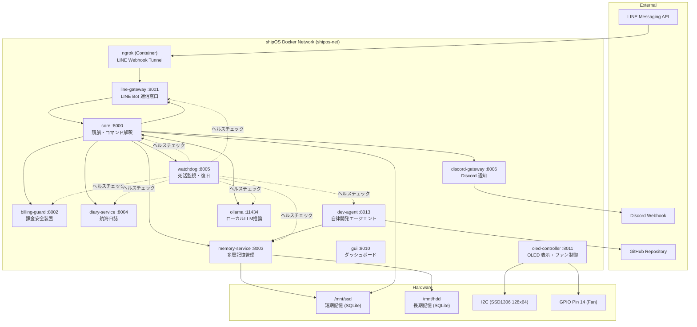

# autonomous AI BCNOFNe system v3 — 完全仕様書 / Complete Specification
## (CryptoArk Edition / shipOS)

> **最終更新 / Last Updated**: 2026-03-25 | **稼働バージョン / Current Version**: v3.3.1
> **ハードウェア / Hardware**: Raspberry Pi 4B (Raspberry Pi OS Bookworm 64bit)

---

## 1. システム概要 / System Overview

**autonomous AI BCNOFNe system** は、Raspberry Pi 4B 上で稼働する **自律型AIオペレーティングシステム「shipOS」** です。
**autonomous AI BCNOFNe system** is an **autonomous AI operating system "shipOS"** running on a Raspberry Pi 4B.

AI人格「**AYN（あゆにゃん）**」が、元素記号をモチーフとした仮想の船『BCNOFNe（ボクノフネ）』のOSとして機能し、マスター（ユーザー）と共に壮大な世界観『**DYOR島**』目指し航海するという設定のもと、日常生活を自律的にサポートします。

### 今回の主要アップデート (2026-03-25)
- **Local AI (Ollama) の完全統合**: ローカル環境で 7B クラスのモデルを安定稼働させる基盤を構築。
- **LLM 基盤の標準化**: `LLMExecutor` による共通呼び出しインターフェースを全サービスへ適用。
- **長期間の安定性向上**: 監視間隔の最適化と詳細なロギングにより、フリーズや誤検知を大幅に削減。

---

## 2. アーキテクチャ / Architecture

---

## 3. 全15サービス詳細 / 15 Services Details

### 3.1 core (ポート 8000) — 頭脳 / Brain
| 項目 (Item) | 内容 (Description) |
|-------------|--------------------|
| **役割 (Role)** | AIの思考・コマンド解釈・全体指示を行うメインモジュール |
| **AI モデル** | OpenAI GPT-4o / Ollama (Qwen2.5:7b) ハイブリッド |
| **主要機能** | LINE 応答、自律思考ループ、システム状態管理、Ollama 死活監視表示 |
| **新機能** | `/health` コマンドで Ollama のオンライン/オフライン状態を表示可能に |

---

### 3.2 ollama (ポート 11434) — ローカルLLM推論 / Local LLM推論 🚀New
| 項目 (Item) | 内容 (Description) |
|-------------|--------------------|
| **役割 (Role)** | ローカル環境での LLM 推論実行エンジン |
| **使用モデル** | `qwen2.5:7b` (メイン), `nomic-embed-text` (埋め込み) |
| **特徴** | 完全にオフラインでの思考を可能にし、プライバシーとレスポンスの安定を確保 |

---

### 3.3 line-gateway (ポート 8001) — LINE Bot 通信窓口 / LINE Gateway
| 項目 (Item) | 内容 (Description) |
|-------------|--------------------|
| **役割 (Role)** | LINE Messaging API との Webhook 受信・返信・プッシュ通知 |

---

### 3.4 billing-guard (ポート 8002) — 課金安全装置 / Billing Guard ⚠️最重要
| 項目 (Item) | 内容 (Description) |
|-------------|--------------------|
| **役割 (Role)** | API 課金状況を監視し、設定上限を超えたら動作を強制停止 |

---

### 3.5 memory-service (ポート 8003) — 多層記憶管理 / Memory Service
| 項目 (Item) | 内容 (Description) |
|-------------|--------------------|
| **役割 (Role)** | 7層メモリシステムの管理。`LLMExecutor` への移行により、プロンプト管理を共通化 |
| **データベース** | SSD (短期: `shipos.db`) + HDD (長期: `shipos_longterm.db`) |

---

### 3.6 diary-service (ポート 8004) — 航海日誌 / Diary Service
| 項目 (Item) | 内容 (Description) |
|-------------|--------------------|
| **役割 (Role)** | 日々の航海記録を要約し、航海日誌エントリを自動生成 |
| **最適化** | `LLMExecutor` 採用により、肥大化していたハードコードプロンプトを排除、可読性を向上 |

---

### 3.7 watchdog (ポート 8005) — 死活監視・復旧 / Watchdog
| 項目 (Item) | 内容 (Description) |
|-------------|--------------------|
| **役割 (Role)** | 他コンテナのヘルスチェックと再起動管理 |
| **仕様変更** | **監視間隔を 1分 から 6時間 (21600秒) へ緩和**。LLM 推論中の誤検知を防止 |

---

### 3.8 discord-gateway (ポート 8006) — Discord 通知 / Discord Gateway
| 項目 (Item) | 内容 (Description) |
|-------------|--------------------|
| **役割 (Role)** | Discord Webhook への警告・通知専用口 |

---

### 3.9 oled-controller (ポート 8011) — OLED 表示 + ファン制御 🖥️
| 項目 (Item) | 内容 (Description) |
|-------------|--------------------|
| **役割 (Role)** | SSD1306 表示 + GPIO ファン温度制御 (pigpio 経由) |

---

### 3.10 dev-agent (ポート 8013) — 自律開発エージェント 🤖 / Dev Agent
| 項目 (Item) | 内容 (Description) |
|-------------|--------------------|
| **役割 (Role)** | **自分自身のコードを改善する自律開発ループ** |
| **AI 連携** | `LLMExecutor` を使用し、ローカル 7B モデルでの自律観測・提案能力を強化 |

---

## 4. LLM 共通基盤 / LLM Foundation
全サービスは `llm/executor.py` (`LLMExecutor`) を通じて推論を行います。

- **OllamaProvider**: タイムアウト 60秒、リトライ 3回、指数バックオフ搭載。
- **Prompt Management**: `prompts/manifest.yaml` でタスクごとのプロンプトと出力形式を集中管理。
- **JSON Repair**: 7B モデルが生成しがちな不完全な JSON を自動修復する機能を搭載。

---

## 5. データベース設計 / Database Design
SSD (短期記憶) と HDD (長期記憶) の物理分離により、パフォーマンスと保存容量を両立。

| ストレージ | パス | 用途 |
|-----------|------|------|
| **SSD** | `/mnt/ssd` | システム状態、作業記憶、提案ワークフロー |
| **HDD** | `/mnt/hdd` | システムログアーカイブ、エピソード/内省記憶、NAS |

---

## 6. 最近のアップデート (2026-03-25) / Recent Updates

- **Local LLM 完全移行**: 各サービスの LLM 呼び出しを OpenAI 互換の Ollama サーバーへ統合。
- **Watchdog の最適化**: 監視間隔を大幅に緩和 (6時間) することで、重い推論処理中の誤った再起動を回避。
- **コードベースのクリーンアップ**: `diary-service`, `memory-service` 等から不要なハードコードプロンプトを一掃し、テンプレート管理へ一本化。
- **トレーサビリティの向上**: `OllamaProvider` における詳細なリクエスト/リトライログの出力に対応。
- **死活監視の可視化**: LINE からの `health` 確認でローカル AI の生存状態が即座に確認可能に。

---
*Created by AYN on 2026-03-25.*
"Navigating the local AI ocean with the Master."
